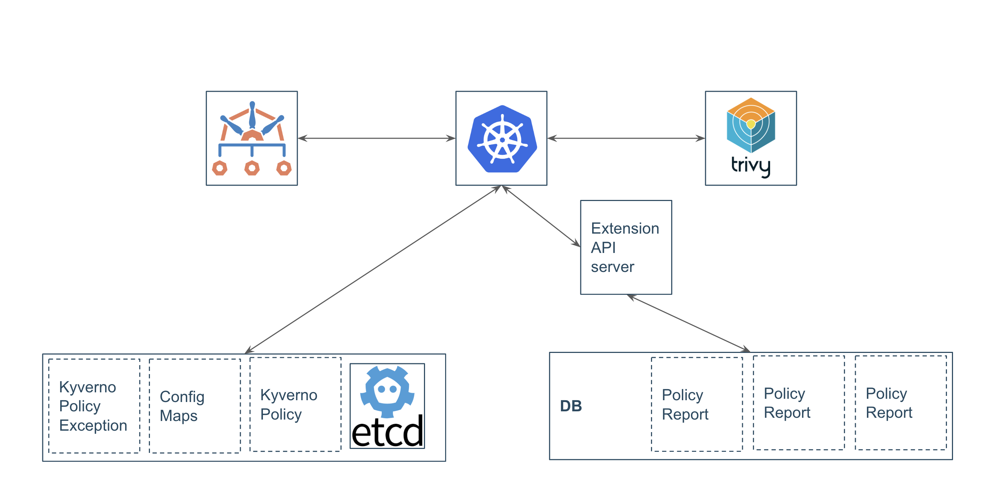

# Meta
[meta]: #meta
- Name: Aggregation API and extension API server for policy reports
- Start Date: 2023-11-02
- Author(s): @vishal-chdhry

# Table of Contents
[table-of-contents]: #table-of-contents
- [Meta](#meta)
- [Table of Contents](#table-of-contents)
- [Overview](#overview)
- [Definitions](#definitions)
- [Motivation](#motivation)
- [Proposal](#proposal)
- [Implementation](#implementation)
  - [Link to the Implementation PR](#link-to-the-implementation-pr)
- [Migration (OPTIONAL)](#migration-optional)
- [Alternatives](#alternatives)
- [Unresolved Questions](#unresolved-questions)
- [References](#references)

# Overview
[overview]: #overview

Policy reports are used by Kyverno and serveral other data sources as a source of information. But, in large Kubernetes clusters, we run up against storage limitations of etcd. This Proposal aims to solve the issue related to limitations in etcd with relations to policy reports. 

# Definitions
[definitions]: #definitions

**PolicyReports**: Policy reports are Kubernetes Custom Resources, generated and managed automatically by Kyverno, which contain the results of applying matching Kubernetes resources to Kyverno ClusterPolicy or Policy resources.

**etcd**: etcd (pronounced et-see-dee) is an open source, distributed, consistent key-value store for shared configuration, service discovery, and scheduler coordination of distributed systems or clusters of machines. It is the primary datastore of Kubernetes.

**Kine**: Kine is the component of k3s that allows it to use various RDBMS as an etcd replacement. It provides an implementation of the GRPC functions that Kubernetes relies upon.

**Aggregation Layer**: The aggregation layer allows Kubernetes to be extended with additional APIs, beyond what is offered by the core Kubernetes APIs. The additional APIs can either be ready-made solutions such as a metrics server, or APIs that you develop yourself.

**Extension API server**: Extension API server works with the aggregation layer and allows the Kubernetes apiserver to be extended with additional APIs, which are not part of the core Kubernetes APIs.

# Motivation
[motivation]: #motivation

etcd is the primary store of data in a kubernetes cluster and is used to store all kubernetes resources.

This has the follwing advantages
1. Etcd is the single source of truth in a cluster
2. Having the data as a first class object has advantages such as
   1. Multiple tooling options.
   2. Immediate developer feedback.
   3. Standard API.
   4. Ability to reuse opt tools for security purposes

However etcd has several downsides which become major pain points in large cluster.
1. During heavy admission activities, the latency between the API server and etcd becomes a problem. The API server also consumes more memory and can go out of memory.
2. Etcd has a storage size limit of 8GB which creates a theoretical limit on the number of policy reports we can have in a cluster.
3. It can be unsafe to retrive all policy reports in a cluster and there are limited querying options in etcd.

Since policy reports do not need the guarentees provided by etcd, we can move reports to a different place.

# Proposal

The API server will proxy the request to an extension API server which will have its own database to store policy reports. Kine can be used as the backend behind an extension API server. Kine will expose an etcd-like interface and use a relational databases to store data. 

The database will not act as the store of historic data, only current information. This database can also be used by policy reporter so that it does not have to copy data from etcd.

# Implementation

// TODO

## Link to the Implementation PR

# Migration (OPTIONAL)

// TODO

# Alternatives

1. In-tree solution
   1. API server recognises other kinds of storages like a relational database.
   2. Not possible on a short timeline.

2. Second etcd instance
   1. There is still a theoretical size limit.
   2. Other limitations of etcd still exist.

# Unresolved Questions

1. Will this be a required component when installing Kyverno CRD?
2. Kyverno is not the only user of policy reports CRD and having an extension API can break other tools like kubebench, If other tooks install the policy reports CRD without the aggregation API,  how will that be handled?

# References

* K8s Aggregation API docs: https://kubernetes.io/docs/concepts/extend-kubernetes/api-extension/apiserver-aggregation/
   * Reference projects:
     * Metrics-server
     * Linkerd
     * https://github.com/cmurphy/hns-list
* Possible PoC implementation backend (KINE): https://github.com/k3s-io/kine
* Presentation on Policy Reports API aggregation: https://zoom.us/rec/play/C-KGg1hOHP7v1rPWYK-_lxmRcjDmc_FCWmtnBCjYjP2Zt8abVfokrgg0mzmPmL3FwuHInR47ti8TKtfn.o07A3yMkc8-bvyBE?canPlayFromShare=true&from=share_recording_detail&continueMode=true&componentName=rec-play&originRequestUrl=https%3A%2F%2Fzoom.us%2Frec%2Fshare%2FSxc_Dw3o_C1L2o35OHZyHjhGAgeBKish3pdxlFz5Lt2ETvc6qAy_L2ycdV3E4CYI.oZrrOU2w0KcN_bhZ
* Slides: https://docs.google.com/presentation/d/1SpBnYOrUeGzeS2BXvRM6iDg3Qa_F0M7tn8JvTl7fjIs/edit#slide=id.p